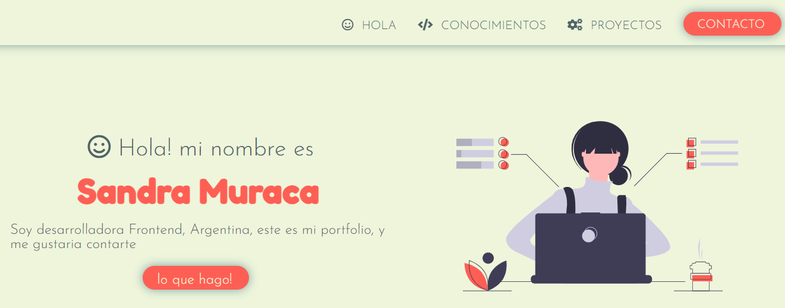

# Portfolio Sandra Muraca😀

Portfolio maquetado en: **HTML**, estilado en **CSS**, este portfolio personal es el trabajo práctico solicitado al finalizar el primer módulo de la certificación como Front End que estoy cursando en ADA ITW.
Fue realizado sobre el modelo presentado por Ada en cuanto a estructura los textos, paleta de colores, tipografias e imágenes fueron de elección propia.

El proyecto está dividido en *4 secciones*:
- **Presentación**: donde me presento brevemente 👋
- **Lo que hago**: donde están linkeados mis proyectos realizados. (Espacio en construcción 🔧).
- **Conocimientos**: donde te detallo cuales son los lenguajes aprendidos (y en proceso, por que nunca sabemos todo)📚.
- **Contacto**: donde encontraras, los links a mis redes, mail y formulario de contacto 📭.

✒ ### **Tipografias utilizadas:**
* Josefin
* Fredoka

🎨 ### **Paleta de Colores***
[En este link podes visitar la paleta utilizada](https://coolors.co/b8d8d8-7a9e9f-4f6367-eef5db-fe5f55)

📷 ### **Imagenes:**
La imagen utilizada para la parte principal de descargo desde: [unDraw.co](https://undraw.co/illustrations)

📌 ### **Iconos:**
Los íconos se utilizados son de [Fontawesome](https://fontawesome.com/)

💻 **Deployado:**
* Fue deployado con Netlify: [link al sitio](https://sandramportfolio.netlify.app/)

🚀 Este proyecto es un proyecto vivo, que irá cambiando y mejorando a medida que sume conocimiento y expediencia. 

🙌 Gracias por visitarlo!

Sandra.-
